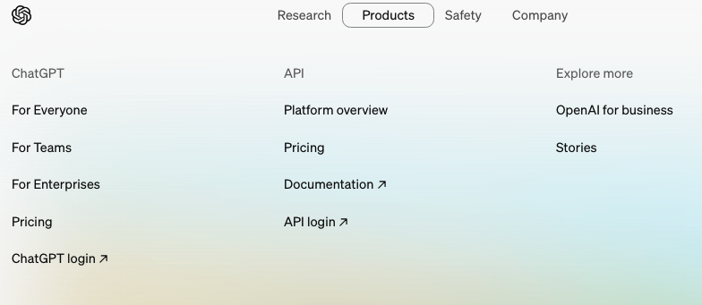
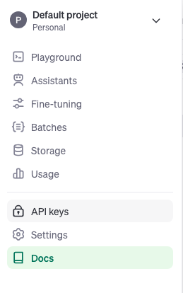

## Open AI GPT4 Java Project  

Open AI GPT4 latest & most performant model is out now.  
We will write a simple java program to show how easy it is to write simple java integration with open api.  

##### Get Open API Keys  

* Visit www.openapi.org  
* Navigate to Open API Login
    
* Create new API key from side bar menu  
    
* Add that api key in system environment variables.  
* Now run the project.  

You will see a result like below, results came back much faster than previous versions of gpt models  :  
```
{
  "id": "chatcmpl-9Py2BxmL7ZRbpKroQuD4mF369o0hX",
  "object": "chat.completion",
  "created": 1715975999,
  "model": "gpt-4o-2024-05-13",
  "choices": [
    {
      "index": 0,
      "message": {
        "role": "assistant",
        "content": "Sure! Here's a random quote from \"The Matrix\":\n\n\"Morpheus: This is your last chance. After this, there is no turning back. You take the blue pill – the story ends, you wake up in your bed and believe whatever you want to believe. You take the red pill – you stay in Wonderland and I show you how deep the rabbit hole goes.\"\n\nIt's a famous scene that symbolizes choice and the quest for truth."
      },
      "logprobs": null,
      "finish_reason": "stop"
    }
  ],
  "usage": {
    "prompt_tokens": 15,
    "completion_tokens": 88,
    "total_tokens": 103
  },
  "system_fingerprint": "fp_927397958d"
}
```